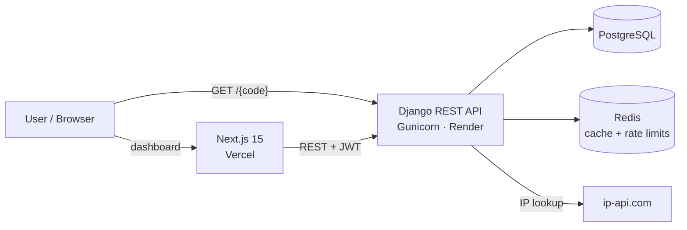

<div align="center">

# 🔗 URL Shortener Service

**A production-style URL shortener with click analytics, QR codes and geolocation, built to showcase backend and DevOps skills.**

Django REST Framework API · Next.js dashboard · PostgreSQL · Redis · Docker · CI/CD


</div>

---

## ✨ Features

| | Feature | Details |
|---|---|---|
| ✂️ | **URL shortening** | Auto-generated short codes or **custom slugs** |
| ⏳ | **Link expiration** | Optional expiry date per link |
| 📊 | **Analytics dashboard** | Clicks, unique visitors, referrers and device types, charted with Recharts |
| 🌍 | **Click geolocation** | Country and city lookup per click (via ip-api.com), shown on a map in the dashboard |
| 📱 | **QR codes** | A QR code for every short link (SVG endpoint + in-app) |
| 🔐 | **JWT authentication** | Register / login with token-based auth |
| 🚦 | **Rate limiting** | 100 req/hour anonymous, 1000 req/hour authenticated |
| ⚡ | **Redis caching** | Hot links are served from cache |
| 📖 | **API docs** | Swagger UI + OpenAPI schema via drf-spectacular |
| 🩺 | **Monitoring** | `/health/`, `/ready/` and Prometheus `/metrics/` endpoints |

---

## 🏗️ Architecture



---

## 🚀 Quick Start

### With Docker (recommended)

```bash
git clone https://github.com/gmgowrish/url_shortener.git
cd url_shortener
docker-compose up -d
```

| Service | URL |
|---|---|
| Frontend | http://localhost:3000 |
| Backend API | http://localhost:8000 |
| Swagger docs | http://localhost:8000/api/docs/ |

### Without Docker

**Backend** (Python 3.11+):
```bash
cd backend
cp .env.example .env          # then edit your settings
python -m venv venv
source venv/bin/activate       # Windows: venv\Scripts\activate
pip install -r requirements.txt
python manage.py migrate
python manage.py runserver
```

**Frontend** (Node.js 20+):
```bash
cd frontend
cp .env.example .env.local
npm install
npm run dev
```

---

## 📡 API

| Method | Endpoint | Description |
|---|---|---|
| `POST` | `/api/token/` | Get a JWT token |
| `POST` | `/api/accounts/register/` | Register a user |
| `GET` | `/api/links/` | List your links |
| `POST` | `/api/links/` | Create a short link |
| `GET` | `/api/links/{id}/` | Link details |
| `DELETE` | `/api/links/{id}/` | Delete a link |
| `GET` | `/api/analytics/summary/` | Analytics summary |
| `GET` | `/api/analytics/link/{id}/` | Per-link analytics |
| `GET` | `/{short_code}/` | Redirect to the original URL |
| `GET` | `/{short_code}/qr/` | QR code (SVG) |

Interactive docs: **`/api/docs/`** · Schema: **`/api/schema/`**

---

## ☁️ Deployment

| Part | Platform | Setup |
|---|---|---|
| Backend | **Render** | Web Service with root directory `backend` (or use `render.yaml`) |
| Frontend | **Vercel** | Root directory `frontend`, set `NEXT_PUBLIC_API_URL` |

GitHub Actions run CI for both apps and deploy on push. See [`docs/DEPLOYMENT.md`](docs/DEPLOYMENT.md) and [`DEPLOYMENT_CHECKLIST.md`](DEPLOYMENT_CHECKLIST.md).

<details>
<summary><b>Environment variables</b></summary>

**Backend (`backend/.env`)**
```env
SECRET_KEY=your-secret-key
DEBUG=False
DATABASE_URL=postgresql://...
REDIS_URL=redis://...
ALLOWED_HOSTS=your-domain.com
CORS_ALLOWED_ORIGINS=https://your-frontend.vercel.app
BASE_URL=https://your-api.onrender.com
```

**Frontend (`frontend/.env.local`)**
```env
NEXT_PUBLIC_API_URL=https://your-api.onrender.com/api
```
</details>

---

## 🧪 Testing

```bash
cd backend
pytest                              # run tests
pytest --cov=. --cov-report=html    # with coverage
```

---

## 🛠️ Tech Stack

| Layer | Tools |
|---|---|
| **Backend** | Django 5, Django REST Framework, SimpleJWT, drf-spectacular, Gunicorn, WhiteNoise, django-prometheus |
| **Data** | PostgreSQL, Redis |
| **Frontend** | Next.js 15 (App Router), React 18, TanStack Query, Recharts, Tailwind CSS, qrcode.react |
| **DevOps** | Docker, Docker Compose, GitHub Actions, Render, Vercel |

## 📁 Project Structure

```
url_shortener/
├── backend/
│   ├── config/        # settings, URLs, health checks
│   ├── accounts/      # registration + JWT auth
│   ├── links/         # shortening, redirects, QR codes
│   ├── analytics/     # click tracking, devices, geolocation
│   ├── api/           # permissions, throttling, shared serializers
│   └── Dockerfile
├── frontend/
│   └── src/
│       ├── app/       # pages: home, login, register, dashboard, link details
│       ├── components/# IP location map & widget
│       └── lib/       # API client
├── docs/              # deployment, monitoring, security guides
├── .github/workflows/ # CI + deploy pipelines
├── docker-compose.yml
└── render.yaml
```

---

## 🔒 Security

- JWT authentication and CORS restricted to the frontend origin
- Rate limiting on all API endpoints
- Secrets kept in environment variables, never in code
- Django ORM and templates protect against SQL injection and XSS
- More details in [`docs/SECURITY.md`](docs/SECURITY.md)

## 💸 Free-tier notes

| Service | Limit |
|---|---|
| Render web service | Spins down after 15 min idle, so the first request is slow |
| Render PostgreSQL | 1 GB; deleted after 90 days inactive |
| Vercel | Generous hobby tier |

---

<div align="center">

Made by **[G M Gowrish](https://github.com/gmgowrish)** · ⭐ Star the repo if you find it useful!

</div>
